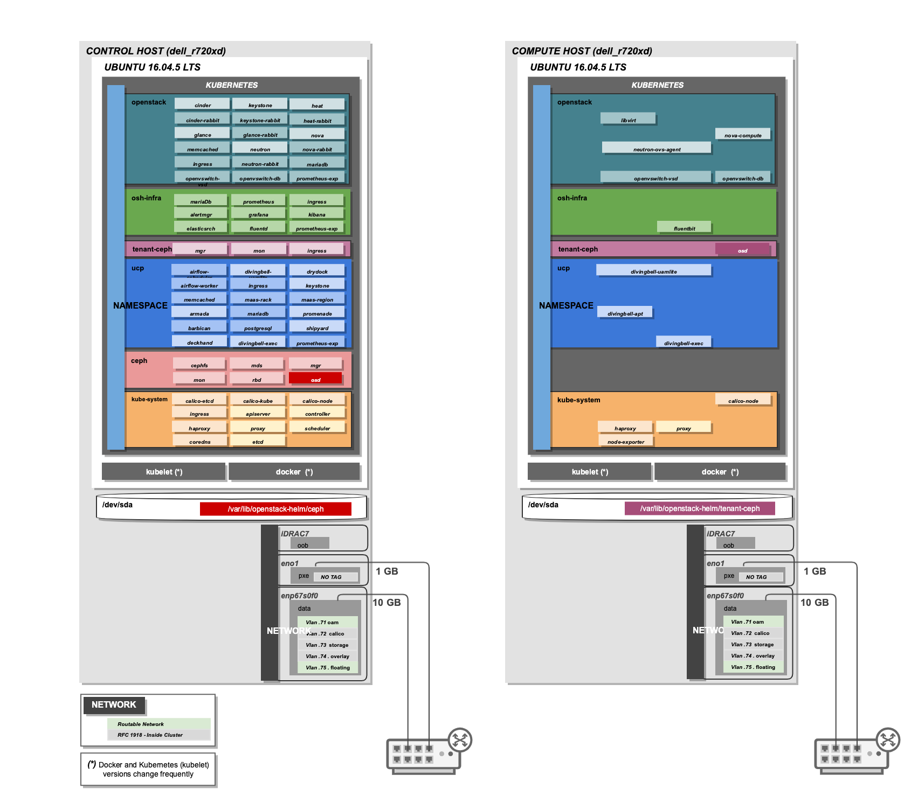

Airsloop: Simple Bare-Metal Airship
===================================

Airsloop is a two node site deployment reference and continuous integration pipeline.
The goal of this site is to be used as a reference for mini Airship deployments
with one controller and one or more compute nodes.

Airsloop is meant to get an operator up and running quickly with an Airship lab environment,
and has some resiliency and security features tuned down.  Please see the `Seaworthy <https://opendev.org/airship/treasuremap/src/branch/master/site/airship-seaworthy>`__
manifests for a production-oriented example.

The site manifests are available at
`site/airsloop <https://opendev.org/airship/treasuremap/src/branch/master/site/airsloop>`__.

Pipeline
--------

Airsloop pipeline automates deployment flow documented in
`Site Authoring and Deployment Guide <https://airship-treasuremap.readthedocs.io/en/latest/authoring_and_deployment.html>`__.

The pipeline is implemented as Jenkins Pipeline (Groovy), see code for the pipeline at
`Jenkinsfile <https://opendev.org/airship/treasuremap/src/branch/master/tools/gate/airsloop/Jenkinsfile>`__.

Versions
--------

The manifest software version overrides (`versions.yaml <https://opendev.org/airship/treasuremap/src/branch/master/global/software/config/versions.yaml>`__)
are setup to deploy OpenStack Ocata.

The versions are kept up to date via `updater.py <https://opendev.org/airship/treasuremap/src/branch/master/tools/updater.py>`__,
a utility that updates versions.yaml latest charts and (selected) images.

The pipeline attempts to uplift and deploy latest versions on daily basis.

Hardware
--------

While HW configuration is flexible, Airsloop reference manifests
reflect a single controller and a single compute node. The aim of
this is to create a minimalistic lab/demo reference environment.

Increasing the number of compute nodes will require site overrides
to align parts of the system such as Ceph osds, etcd, etc.

This site is stripped down from all the complicated hardware and
configuration requirements that Airship Seaworthy site is using and that leads
to simplified deployments from disk,networking and hardware perspective.

Airsloop site has 2 bare-metal servers:
1 controller, and 1 compute node.
See host profiles for the servers `here <https://opendev.org/airship/treasuremap/src/branch/master/site/airsloop/profiles/host>`__.

Control (masters)
 - airsloop-control-1
Compute (workers)
 - airsloop-compute-1

For simplification of the configuration, we recommend using hostnames
provided below.

For a two node deployment the nodes and their hostnames are:

+------------+-------------------------+
| Node       | Hostnames               |
+============+=========================+
| controller | airsloop-controller-1   |
+------------+-------------------------+
| compute    | airsloop-compute-1      |
+------------+-------------------------+

Network
-------

Physical (underlay) networks are described in Drydock site configuration
`here <https://opendev.org/airship/treasuremap/src/branch/master/site/airsloop/networks/physical/networks.yaml>`__.
It defines OOB (iLO/IPMI), untagged PXE, and multiple tagged general use networks.
Also no bond interfaces are used in Airsloop deployment.

In this deployment the networking is simplified compared to Airship Seaworthy
site. There are only two NICs required (excluding oob), one for PXE
and another one for the rest of the networks separated using VLAN
segmentation. The recommendation is to use the highest bandwidth device
available to carry to carry the data networks.

Below is an example of network configuration:

+------------+------------+-----------+---------------+
| NICs       | VLANs      | Names     |     CIDRs     |
+============+============+===========+===============+
| oob        | N/A        | oob       |10.22.104.0/24 |
+------------+------------+-----------+---------------+
| pxe        | N/A        | pxe       |10.22.70.0/24  |
+------------+------------+-----------+---------------+
|            | 71         | oam       |10.22.71.0/24  |
|            +------------+-----------+---------------+
|            | 72         | calico    |10.22.72.0/24  |
| data       +------------+-----------+---------------+
|            | 73         | storage   |10.22.73.0/24  |
|            +------------+-----------+---------------+
|            | 74         | overlay   |10.22.74.0/24  |
+------------+------------+-----------+---------------+

Calico overlay for k8s POD networking uses IPIP mesh.

Storage
-------

Because Airsloop is a minimalistic deployment the required number of disks is just
one per node. That disk is not only used by the OS but also by Ceph Journals and OSDs.
The way that this is achieved is by using directories and not extra
disks for Ceph storage. Ceph OSD configuration can be changed in a `Ceph chart override <https://opendev.org/airship/treasuremap/src/branch/master/type/sloop/charts/ucp/ceph/ceph-osd.yaml>`__.

Host Profiles
-------------

Host profiles in Airship are tightly coupled with the hardware profiles.
That means every disk or interface which is described in host profiles
should have a corresponding reference to the hardware profile which is
being used.

Airship always identifies every NIC or disk by its PCI or
SCSI address and that means that the interfaces and the disks that are
defined in host and hardware profiles should have the correct PCI and
SCSI addresses objectively.

Let's give an example by following the host profile of Airsloop site.

In this `Host Profile <https://opendev.org/airship/treasuremap/src/branch/master/site/airsloop/profiles/host/compute.yaml>`__
is defined that the slave interface that will be used for the pxe
boot will be the pxe_nic01. That means a corresponding entry should
exist in this `Hardware Profile <https://opendev.org/airship/treasuremap/src/branch/master/site/airsloop/profiles/hardware/dell_r720xd.yaml>`__
which it does. So when drydock and maas try to deploy the node it will
identify the interface by the PCI address that is written in the
Hardware profile.

A simple way to find out which PCI od SCSi address corresponds to which
NIC or Disk is to use the lshw command. More inforamtion about that
command can be found `Here <https://linux.die.net/man/1/lshw>`__.

Extend Cluster
--------------

This section describes what changes need to be made to the existing
manifests of Airsloop for the addition of an extra compute node to the
cluster.

First and foremost the user should go to the `nodes.yaml <https://opendev.org/airship/treasuremap/src/branch/master/site/airsloop/baremetal/nodes.yaml>`__
file and add an extra section for the new compute node.

The next step is to add a similar section as the existing
airsloop-compute-1 section to the `pki-catalog.yaml <https://opendev.org/airship/treasuremap/src/branch/master/site/airsloop/pki/pki-catalog.yaml>`__.
This is essential for the correct generation of certificates and the
correct communication between the nodes in the cluster.

Also every time the user adds an extra compute node to the cluster then the
number of OSDs that are managed by this manifest `Ceph-client <https://opendev.org/airship/treasuremap/src/branch/master/site/airsloop/software/charts/osh/ceph/ceph-client.yaml>`__
should be increased by one.

Last step is to regenerate the certificates which correspond to this
`certificates.yaml <https://opendev.org/airship/treasuremap/src/branch/master/site/airsloop/secrets/certificates/certificates.yaml>`__
file so the changes in the pki-catalog.yaml file takes place.
This can be done through the promenade CLI.

Getting Started
---------------

TODO: Specify which node(s) the command(s) in this section are run on.
Also if there is an assumption that we have a node with Ubuntu
already provisioned, that assumption or steps should be specified
along with any Ubuntu version requirements/assumptions and other
pre-requisite steps (e.g., installing NTP)

Below are the steps that a user should follow to deploy the Airsloop site:

TODO: Add the prerequisite steps that the user needs to do
before starting executing the below steps such as:
installing git, installing docker, clone sevral repos etc.

1. Collect manifests

.. code-block:: bash

    ./tools/airship pegleg site -r /target collect airsloop -s collect

2. Generate certs

.. code-block:: bash

    ./tools/airship promenade generate-certs -o /target/certs /target/collect/*.yaml

3. Generate genesis.sh scipt

.. code-block:: bash

    ./tools/airship promenade build-all -o /target/bundle /target/collect/*.yaml /target/certs/*.yaml

4. Execute the genesis.sh script

.. code-block:: bash

     cd /target/bundle
     ./genesis.sh

If the genesis.sh script completed succesfully

5. Deploy site through shipyard

.. code-block:: bash

    ./tools/airship shipyard create configdocs design --directory=/target/collect
    ./tools/airship shipyard commit configdocs
    ./tools/airship shipyard create action deploy_site

6. Check the actions that are already created

.. code-block:: bash

    ./tools/shipyard get actions
