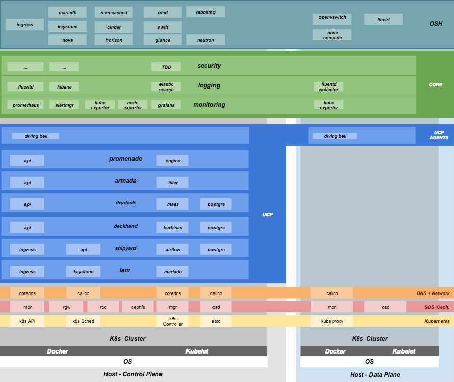

Site Authoring and Deployment Guide
===================================

The document contains the instructions for standing up a greenfield
Airship site. This can be broken down into two high-level pieces:

1. **Site authoring guide(s)**: Describes how to craft site manifests
   and configs required to perform a deployment. The primary site
   authoring guide is for deploying Airship sites, where OpenStack
   is the target platform deployed on top of Airship.
2. **Deployment guide(s)**: Describes how to apply site manifests for a
   given site.

This document is an "all in one" site authoring guide + deployment guide
for a standard Airship deployment. For the most part, the site
authoring guidance lives within ``seaworthy`` reference site in the
form of YAML comments.

Terminology
-----------

**Cloud**: A platform that provides a standard set of interfaces for
`IaaS <https://en.wikipedia.org/wiki/Infrastructure_as_a_service>`__
consumers.

**OSH**: (`OpenStack
Helm <https://docs.openstack.org/openstack-helm/latest/>`__) is a
collection of Helm charts used to deploy OpenStack on kubernetes.

**Undercloud/Overcloud**: Terms used to distinguish which cloud is
deployed on top of the other. In Airship sites, OpenStack (overcloud)
is deployed on top of Kubernetes (undercloud).

**Airship**: A specific implementation of OpenStack Helm charts onto
kubernetes, the deployment of which is the primary focus of this document.

**Control Plane**: From the point of view of the cloud service provider,
the control plane refers to the set of resources (hardware, network,
storage, etc) sourced to run cloud services.

**Data Plane**: From the point of view of the cloud service provider,
the data plane is the set of resources (hardware, network, storage,
etc.) sourced to run consumer workloads. When used in this document,
"data plane" refers to the data plane of the overcloud (OSH).

**Host Profile**: A host profile is a standard way of configuring a bare
metal host. Encompasses items such as the number of bonds, bond slaves,
physical storage mapping and partitioning, and kernel parameters.

Component Overview
~~~~~~~~~~~~~~~~~~

Node Overview
~~~~~~~~~~~~~

This document refers to several types of nodes, which vary in their
purpose, and to some degree in their orchestration / setup:

-  **Build node**: This refers to the environment where configuration
   documents are built for your environment (e.g., your laptop)
-  **Genesis node**: The "genesis" or "seed node" refers to a node used
   to get a new deployment off the ground, and is the first node built
   in a new deployment environment.
-  **Control / Controller nodes**: The nodes that make up the control
   plane. (Note that the Genesis node will be one of the controller
   nodes.)
-  **Compute nodes / Worker Nodes**: The nodes that make up the data
   plane

Support
-------

Bugs may be viewed and reported at the following locations, depending on
the component:

-  OpenStack Helm: `OpenStack Storyboard group
   <https://storyboard.openstack.org/#!/project_group/64>`__

-  Airship: Bugs may be filed using OpenStack Storyboard for specific
   projects in `Airship
   group <https://storyboard.openstack.org/#!/project_group/85>`__:

    -  `Airship Armada <https://storyboard.openstack.org/#!/project/1002>`__
    -  `Airship Berth <https://storyboard.openstack.org/#!/project/1003>`__
    -  `Airship
       Deckhand <https://storyboard.openstack.org/#!/project/1004>`__
    -  `Airship
       Divingbell <https://storyboard.openstack.org/#!/project/1001>`__
    -  `Airship
       Drydock <https://storyboard.openstack.org/#!/project/1005>`__
    -  `Airship MaaS <https://storyboard.openstack.org/#!/project/1007>`__
    -  `Airship Pegleg <https://storyboard.openstack.org/#!/project/1008>`__
    -  `Airship
       Promenade <https://storyboard.openstack.org/#!/project/1009>`__
    -  `Airship
       Shipyard <https://storyboard.openstack.org/#!/project/1010>`__
    -  `Airship in a
       Bottle <https://storyboard.openstack.org/#!/project/1006>`__

    -  `Airship Treasuremap
       <https://storyboard.openstack.org/#!/project/openstack/airship-treasuremap>`__

Hardware Prep
-------------

Disk
~~~~

1. For servers that are in the control plane (including Genesis):

   - Two-disk RAID-1: Operating System
   - Two disks JBOD: Ceph Journal/Meta for control plane
   - Remaining disks JBOD: Ceph OSD for control plane

2. For servers that are in the tenant data plane (compute nodes):

   - Two-disk RAID-1: Operating System
   - Two disks JBOD: Ceph Journal/Meta for tenant-ceph
   - Two disks JBOD: Ceph OSD for tenant-ceph
   - Remaining disks need to be configured according to the host profile target
     for each given server (e.g. RAID-10 for OpenStack Ephemeral).

BIOS and IPMI
~~~~~~~~~~~~~

1. Virtualization enabled in BIOS
2. IPMI enabled in server BIOS (e.g., IPMI over LAN option enabled)
3. IPMI IPs assigned, and routed to the environment you will deploy into
   Note: Firmware bugs related to IPMI are common. Ensure you are running the
   latest firmware version for your hardware. Otherwise, it is recommended to
   perform an iLo/iDrac reset, as IPMI bugs with long-running firmware are not
   uncommon.
4. Set PXE as first boot device and ensure the correct NIC is selected for PXE

Network
~~~~~~~

1. You have a network you can successfully PXE boot with your network topology
   and bonding settings (dedicated PXE interace on untagged/native VLAN in this
   example)
2. You have (VLAN) segmented, routed networks accessible by all nodes for:

   1. Management network(s) (k8s control channel)
   2. Calico network(s)
   3. Storage network(s)
   4. Overlay network(s)
   5. Public network(s)

HW Sizing and minimum requirements
----------------------------------

+----------+----------+----------+----------+
|  Node    |   disk   |  memory  |   cpu    |
+==========+==========+==========+==========+
|  Build   |   10 GB  |  4 GB    |   1      |
+----------+----------+----------+----------+
| Genesis  |   100 GB |  16 GB   |   8      |
+----------+----------+----------+----------+
| Control  |   10 TB  |  128 GB  |   24     |
+----------+----------+----------+----------+
| Compute  |   N/A*   |  N/A*    |   N/A*   |
+----------+----------+----------+----------+

* Workload driven (determined by host profile)

Establishing build node environment
-----------------------------------

1. On the machine you wish to use to generate deployment files, install required
   tooling::

    sudo apt -y install docker.io git

2. Clone and link the required git repos as follows::

    git clone https://git.openstack.org/openstack/airship-pegleg
    git clone https://git.openstack.org/openstack/airship-treasuremap

Building Site documents
-----------------------

This section goes over how to put together site documents according to
your specific environment, and generate the initial Promenade bundle
needed to start the site deployment.

Preparing deployment documents
~~~~~~~~~~~~~~~~~~~~~~~~~~~~~~

In its current form, pegleg provides an organized structure for YAML
elements, in order to separate common site elements (i.e., ``global``
folder) from unique site elements (i.e., ``site`` folder).

To gain a full understanding of the pegleg structure, it is highly
recommended to read pegleg documentation on this
`here <https://airship-pegleg.readthedocs.io/>`__.

The ``seaworthy`` site may be used as reference site. It is the
principal pipeline for integration and continuous deployment testing of Airship.

Change directory to the ``airship-treasuremap/site`` folder and copy the
``seaworthy`` site as follows:

::

    NEW_SITE=mySite # replace with the name of your site
    cd airship-treasuremap/site
    cp -r seaworthy $NEW_SITE

Remove ``seaworthy`` specific certificates.

::

    rm -f airship-treasuremap/site/${NEW_SITE}/secrets/certificates/certificates.yaml

You will then need to manually make changes to these files. These site
manifests are heavily commented to explain parameters, and importantly
identify all of the parameters that need to change when authoring a new
site.

These areas which must be updated for a new site are flagged with the
label ``NEWSITE-CHANGEME`` in YAML commentary. Search for all instances
of ``NEWSITE-CHANGEME`` in your new site definition, and follow the
instructions that accompany the tag in order to make all needed changes
to author your new Airship site.

Because some files depend on (or will repeat) information from others,
the order in which you should build your site files is as follows:

1. site/$NEW\_SITE/networks/physical/networks.yaml
2. site/$NEW\_SITE/baremetal/nodes.yaml
3. site/$NEW\_SITE/networks/common-addresses.yaml
4. site/$NEW\_SITE/pki/pki-catalog.yaml
5. All other site files

Register DNS names
~~~~~~~~~~~~~~~~~~

Register the following list of DNS names:

::

    cloudformation.DOMAIN
    compute.DOMAIN
    dashboard.DOMAIN
    drydock.DOMAIN
    grafana.DOMAIN
    iam.DOMAIN
    identity.DOMAIN
    image.DOMAIN
    kibana.DOMAIN
    maas.DOMAIN
    nagios.DOMAIN
    network.DOMAIN
    nova-novncproxy.DOMAIN
    object-store.DOMAIN
    orchestration.DOMAIN
    placement.DOMAIN
    shipyard.DOMAIN
    volume.DOMAIN

Here ``DOMAIN`` is a name of ingress domain, you can find it in the
``data.dns.ingress_domain`` section of
``site/${NEW_SITE}/secrets/certificates/ingress.yaml`` configuration file.

Run the following command to get up to date list of required DNS names:

::

    grep -E 'host: .+DOMAIN' site/${NEW_SITE}/software/config/endpoints.yaml | \
        sort -u | awk '{print $2}'

Update Secrets
~~~~~~~~~~~~~~

Replace passphrases under ``site/${NEW_SITE}/secrets/passphrases/``
with random generated ones:

- Passpharses generation ``openssl rand -hex 10``
- UUID generation ``uuidgen`` (e.g. for Ceph filesystem ID)
- Update ``secrets/passphrases/ipmi_admin_password.yaml`` with IPMI password
- Update ``secrets/passphrases/ubuntu_crypt_password.yaml`` with password hash:

::

    python3 -c "from crypt import *; print(crypt('<YOUR_PASSWORD>', METHOD_SHA512))"

Configure certificates in ``site/${NEW_SITE}/secrets/certificates/ingress.yaml``,
they need to be issued for the domains configured in ``Register DNS names`` section.

.. caution::

    It is required to configure valid certificates, self-signed certificates
    are not supported.

Control Plane & Tenant Ceph Cluster Notes
~~~~~~~~~~~~~~~~~~~~~~~~~~~~~~~~~~~~~~~~~

Configuration variables for ceph control plane are located in:

- ``site/${NEW_SITE}/software/charts/ucp/ceph/ceph-osd.yaml``
- ``site/${NEW_SITE}/software/charts/ucp/ceph/ceph-client.yaml``

Configuration variables for tenant ceph are located in:

- ``site/${NEW_SITE}/software/charts/osh/openstack-tenant-ceph/ceph-osd.yaml``
- ``site/${NEW_SITE}/software/charts/osh/openstack-tenant-ceph/ceph-client.yaml``

Setting highlights:

-  data/values/conf/storage/osd[\*]/data/location: The block device that
   will be formatted by the Ceph chart and used as a Ceph OSD disk
-  data/values/conf/storage/osd[\*]/journal/location: The block device
   backing the ceph journal used by this OSD. Refer to the journal
   paradigm below.
-  data/values/conf/pool/target/osd: Number of OSD disks on each node

Assumptions:

1. Ceph OSD disks are not configured for any type of RAID, they
   are configured as JBOD when connected through a RAID controller.
   If RAID controller does not support JBOD, put each disk in its
   own RAID-0 and enable RAID cache and write-back cache if the
   RAID controller supports it.
2. Ceph disk mapping, disk layout, journal and OSD setup is the same
   across Ceph nodes, with only their role differing. Out of the 4
   control plane nodes, we expect to have 3 actively participating in
   the Ceph quorom, and the remaining 1 node designated as a standby
   Ceph node which uses a different control plane profile
   (cp\_*-secondary) than the other three (cp\_*-primary).
3. If doing a fresh install, disk are unlabeled or not labeled from a
   previous Ceph install, so that Ceph chart will not fail disk
   initialization.

It's highly recommended to use SSD devices for Ceph Journal partitions.

If you have an operating system available on the target hardware, you
can determine HDD and SSD devices with:

::

    lsblk -d -o name,rota

where a ``rota`` (rotational) value of ``1`` indicates a spinning HDD,
and where a value of ``0`` indicates non-spinning disk (i.e. SSD). (Note
- Some SSDs still report a value of ``1``, so it is best to go by your
server specifications).

For OSDs, pass in the whole block device (e.g., ``/dev/sdd``), and the
Ceph chart will take care of disk partitioning, formatting, mounting,
etc.

For Ceph Journals, you can pass in a specific partition (e.g., ``/dev/sdb1``),
note that it's not required to pre-create these partitions, Ceph chart
will create journal partitions automatically if they don't exist.
By default the size of every journal partition is 10G, make sure
there is enough space available to allocate all journal partitions.

Consider the following example where:

-  /dev/sda is an operating system RAID-1 device (SSDs for OS root)
-  /dev/sd[bc] are SSDs for ceph journals
-  /dev/sd[efgh] are HDDs for OSDs

The data section of this file would look like:

::

    data:
      values:
        conf:
          storage:
            osd:
              - data:
                  type: block-logical
                  location: /dev/sde
                journal:
                  type: block-logical
                  location: /dev/sdb1
              - data:
                  type: block-logical
                  location: /dev/sdf
                journal:
                  type: block-logical
                  location: /dev/sdb2
              - data:
                  type: block-logical
                  location: /dev/sdg
                journal:
                  type: block-logical
                  location: /dev/sdc1
              - data:
                  type: block-logical
                  location: /dev/sdh
                journal:
                  type: block-logical
                  location: /dev/sdc2

Manifest linting and combining layers
~~~~~~~~~~~~~~~~~~~~~~~~~~~~~~~~~~~~~

After constituent YAML configurations are finalized, use Pegleg to lint
your manifests, and resolve any issues that result from linting before
proceeding:

::

    sudo airship-pegleg/tools/pegleg.sh repo \
      -r airship-treasuremap lint

Note: ``P001`` and ``P003`` linting errors are expected for missing
certificates, as they are not generated until the next section. You may
suppress these warnings by appending ``-x P001 -x P003`` to the lint
command.

Next, use pegleg to perform the merge that will yield the combined
global + site type + site YAML:

::

    sudo sh airship-pegleg/tools/pegleg.sh site \
      -r airship-treasuremap \
      collect $NEW_SITE

Perform a visual inspection of the output. If any errors are discovered,
you may fix your manifests and re-run the ``lint`` and ``collect``
commands.

After you have an error-free output, save the resulting YAML as follows:

::

    sudo airship-pegleg/tools/pegleg.sh site \
      -r airship-treasuremap \
      collect $NEW_SITE -s ${NEW_SITE}_collected

It is this output which will be used in subsequent steps.

Lastly, you should also perform a ``render`` on the documents. The
resulting render from Pegleg will not be used as input in subsequent
steps, but is useful for understanding what the document will look like
once Deckhand has performed all substitutions, replacements, etc. This
is also useful for troubleshooting, and addressing any Deckhand errors
prior to submitting via Shipyard:

::

    sudo airship-pegleg/tools/pegleg.sh site \
      -r airship-treasuremap \
      render $NEW_SITE

Inspect the rendered document for any errors. If there are errors,
address them in your manifests and re-run this section of the document.

Building the Promenade bundle
~~~~~~~~~~~~~~~~~~~~~~~~~~~~~

Clone the Promenade repo, if not already cloned:

::

    git clone https://opendev.org/airship/promenade

Refer to the ``data/charts/ucp/promenade/reference`` field in
``airship-treasuremap/global/software/config/versions.yaml``. If
this is a pinned reference (i.e., any reference that's not ``master``),
then you should checkout the same version of the Promenade repository.
For example, if the Promenade reference was ``86c3c11...`` in the
versions file, checkout the same version of the Promenade repo which was
cloned previously:

::

    (cd promenade && git checkout 86c3c11)

Likewise, before running the ``simple-deployment.sh`` script, you should
refer to the ``data/images/ucp/promenade/promenade`` field in
``~/airship-treasuremap/global/software/config/versions.yaml``. If
there is a pinned reference (i.e., any image reference that's not
``latest``), then this reference should be used to set the
``IMAGE_PROMENADE`` environment variable. For example, if the Promenade
image was pinned to ``quay.io/airshipit/promenade:d30397f...`` in
the versions file, then export the previously mentioned environment
variable like so:

::

    export IMAGE_PROMENADE=quay.io/airshipit/promenade:d30397f...

Now, create an output directory for Promenade bundles and run the
``simple-deployment.sh`` script:

::

    mkdir ${NEW_SITE}_bundle
    sudo -E promenade/tools/simple-deployment.sh ${NEW_SITE}_collected ${NEW_SITE}_bundle

Estimated runtime: About **1 minute**

After the bundle has been successfully created, copy the generated
certificates into the security folder. Ex:

::

    mkdir -p airship-treasuremap/site/${NEW_SITE}/secrets/certificates
    sudo cp ${NEW_SITE}_bundle/certificates.yaml \
      airship-treasuremap/site/${NEW_SITE}/secrets/certificates/certificates.yaml

Regenerate collected YAML files to include copied certificates:

::

    sudo airship-pegleg/tools/pegleg.sh site \
      -r airship-treasuremap \
      collect $NEW_SITE -s ${NEW_SITE}_collected

Genesis node
------------

Initial setup
~~~~~~~~~~~~~

Before starting, ensure that the BIOS and IPMI settings match those
stated previously in this document. Also ensure that the hardware RAID
is setup for this node per the control plane disk configuration stated
previously in this document.

Then, start with a manual install of Ubuntu 16.04 on the node you wish
to use to seed the rest of your environment standard `Ubuntu
ISO <http://releases.ubuntu.com/16.04>`__.
Ensure to select the following:

-  UTC timezone
-  Hostname that matches the Genesis hostname given in
   ``/data/genesis/hostname`` in
   ``airship-treasuremap/site/${NEW_SITE}/networks/common-addresses.yaml``.
-  At the ``Partition Disks`` screen, select ``Manual`` so that you can
   setup the same disk partitioning scheme used on the other control
   plane nodes that will be deployed by MaaS. Select the first logical
   device that corresponds to one of the RAID-1 arrays already setup in
   the hardware controller. On this device, setup partitions matching
   those defined for the ``bootdisk`` in your control plane host profile
   found in ``airship-treasuremap/site/${NEW_SITE}/profiles/host``.
   (e.g., 30G for /, 1G for /boot, 100G for /var/log, and all remaining
   storage for /var). Note that the volume size syntax looking like
   ``>300g`` in Drydock means that all remaining disk space is allocated
   to this volume, and that volume needs to be at least 300G in
   size.
-  Ensure that OpenSSH and Docker (Docker is needed because of
   miniMirror) are included as installed packages
-  When you get to the prompt, "How do you want to manage upgrades on
   this system?", choose "No automatic updates" so that packages are
   only updated at the time of our choosing (e.g. maintenance windows).
-  Ensure the grub bootloader is also installed to the same logical
   device as in the previous step (this should be default behavior).

After installation, ensure the host has outbound internet access and can
resolve public DNS entries (e.g., ``nslookup google.com``,
``curl https://www.google.com``).

Ensure that the deployed Genesis hostname matches the hostname in
``data/genesis/hostname`` in
``airship-treasuremap/site/${NEW_SITE}/networks/common-addresses.yaml``.
If it does not match, then either change the hostname of the node to
match the configuration documents, or re-generate the configuration with
the correct hostname. In order to change the hostname of the deployed
node, you may run the following:

::

    sudo hostname $NEW_HOSTNAME
    sudo sh -c "echo $NEW_HOSTNAME > /etc/hostname"
    sudo vi /etc/hosts # Anywhere the old hostname appears in the file, replace
                       # with the new hostname

Or to regenerate manifests, re-run the previous two sections with the
after updating the genesis hostname in the site definition.

Installing matching kernel version
~~~~~~~~~~~~~~~~~~~~~~~~~~~~~~~~~~

Install the same kernel version on the Genesis host that MaaS will use
to deploy new baremetal nodes.

In order to do this, first you must determine the kernel version that
will be deployed to those nodes. Start by looking at the host profile
definition used to deploy other control plane nodes by searching for
``control-plane: enabled``. Most likely this will be a file under
``global/profiles/host``. In this file, find the kernel info -
e.g.:

::

  platform:
    image: 'xenial'
    kernel: 'hwe-16.04'
    kernel_params:
      kernel_package: 'linux-image-4.15.0-46-generic'

It is recommended to install the latest kernel. Check the latest
available kernel, update the site specs and Regenerate collected
YAML files.

Define any proxy environment variables needed for your environment to
reach public Ubuntu package repos, and install the matching kernel on the
Genesis host (make sure to run on Genesis host, not on the build host):

To install the latest hwe-16.04 kernel:

::

    sudo apt-get install --install-recommends linux-generic-hwe-16.04

To install the latest ga-16.04 kernel:

::

    sudo apt-get install --install-recommends linux-generic

Check the installed packages on the genesis host with ``dpkg --list``.
If there are any later kernel versions installed, remove them with
``sudo apt remove``, so that the newly install kernel is the latest
available. Boot the genesis node using install kernel.

Install ntpdate/ntp
~~~~~~~~~~~~~~~~~~~

Install and run ntpdate, to ensure a reasonably sane time on genesis
host before proceeding:

::

    sudo apt -y install ntpdate
    sudo ntpdate ntp.ubuntu.com

If your network policy does not allow time sync with external time
sources, specify a local NTP server instead of using ``ntp.ubuntu.com``.

Then, install the NTP client:

::

    sudo apt -y install ntp

Add the list of NTP servers specified in ``data/ntp/servers_joined`` in
file
``airship-treasuremap/site/${NEW_SITE}/networks/common-address.yaml``
to ``/etc/ntp.conf`` as follows:

::

    pool NTP_SERVER1 iburst
    pool NTP_SERVER2 iburst
    (repeat for each NTP server with correct NTP IP or FQDN)

Then, restart the NTP service:

::

    sudo service ntp restart

If you cannot get good time to your selected time servers,
consider using alternate time sources for your deployment.

Disable the apparmor profile for ntpd:

::

    sudo ln -s /etc/apparmor.d/usr.sbin.ntpd /etc/apparmor.d/disable/
    sudo apparmor_parser -R /etc/apparmor.d/usr.sbin.ntpd

This prevents an issue with the MaaS containers, which otherwise get
permission denied errors from apparmor when the MaaS container tries to
leverage libc6 for /bin/sh when MaaS container ntpd is forcefully
disabled.

Promenade bootstrap
~~~~~~~~~~~~~~~~~~~

Copy the ``${NEW_SITE}_bundle`` and ``${NEW_SITE}_collected``
directories from the build node to the genesis node, into the home
directory of the user there (e.g., ``/home/ubuntu``). Then, run the
following script as sudo on the genesis node:

::

    cd ${NEW_SITE}_bundle
    sudo ./genesis.sh

Estimated runtime: **40m**

Following completion, run the ``validate-genesis.sh`` script to ensure
correct provisioning of the genesis node:

::

    cd ${NEW_SITE}_bundle
    sudo ./validate-genesis.sh

Estimated runtime: **2m**

Deploy Site with Shipyard
-------------------------

Start by cloning the shipyard repository to the Genesis node:

::

    git clone https://opendev.org/airship/shipyard

Refer to the ``data/charts/ucp/shipyard/reference`` field in
``airship-treasuremap/global/software/config/versions.yaml``. If
this is a pinned reference (i.e., any reference that's not ``master``),
then you should checkout the same version of the Shipyard repository.
For example, if the Shipyard reference was ``7046ad3...`` in the
versions file, checkout the same version of the Shipyard repo which was
cloned previously:

::

    (cd shipyard && git checkout 7046ad3)

Likewise, before running the ``deckhand_load_yaml.sh`` script, you
should refer to the ``data/images/ucp/shipyard/shipyard`` field in
``airship-treasuremap/global/software/config/versions.yaml``. If
there is a pinned reference (i.e., any image reference that's not
``latest``), then this reference should be used to set the
``SHIPYARD_IMAGE`` environment variable. For example, if the Shipyard
image was pinned to ``quay.io/airshipit/shipyard@sha256:dfc25e1...`` in
the versions file, then export the previously mentioned environment
variable:

::

    export SHIPYARD_IMAGE=quay.io/airshipit/shipyard@sha256:dfc25e1...

Export valid login credentials for one of the Airship Keystone users defined
for the site. Currently there is no authorization checks in place, so
the credentials for any of the site-defined users will work. For
example, we can use the ``shipyard`` user, with the password that was
defined in
``airship-treasuremap/site/${NEW_SITE}/secrets/passphrases/ucp_shipyard_keystone_password.yaml``.
Ex:

::

    export OS_USERNAME=shipyard
    export OS_PASSWORD=46a75e4...

(Note: Default auth variables are defined
`here <https://opendev.org/airship/shipyard/src/branch/master/tools/shipyard_docker_base_command.sh>`__,
and should otherwise be correct, barring any customizations of these
site parameters).

Next, run the deckhand\_load\_yaml.sh script providing an absolute path
to a directory that contains collected manifests:

::

    sudo -E shipyard/tools/deckhand_load_yaml.sh ${NEW_SITE} $(pwd)/${NEW_SITE}_collected

Estimated runtime: **3m**

Now deploy the site with shipyard:

::

    cd shipyard/tools/
    sudo -E ./deploy_site.sh

Estimated runtime: **1h30m**

The message ``Site Successfully Deployed`` is the expected output at the
end of a successful deployment. In this example, this means that Airship and
OSH should be fully deployed.

Disable password-based login on Genesis
---------------------------------------

Before proceeding, verify that your SSH access to the Genesis node is
working with your SSH key (i.e., not using password-based
authentication).

Then, disable password-based SSH authentication on Genesis in
``/etc/ssh/sshd_config`` by uncommenting the ``PasswordAuthentication``
and setting its value to ``no``. Ex:

::

    PasswordAuthentication no

Then, restart the ssh service:

::

    sudo systemctl restart ssh

