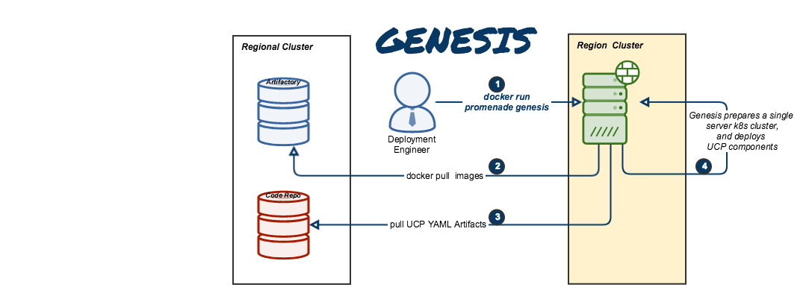
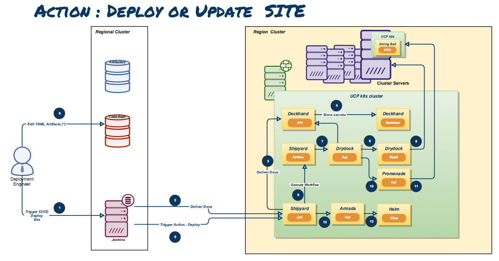

Airship Treasuremap
===================

Airship is a collection of components that coordinate to form means of
configuring and deploying and maintaining
a `Kubernetes <https://kubernetes.io/>`__ environment using a
declarative set of `yaml <http://yaml.org/>`__ documents.

More specifically, the current focus of this project is the implementation of
OpenStack on Kubernetes (OOK).

.. image:: diagrams/architecture.png

Component Projects
==================

Pegleg
------

`Pegleg <https://opendev.org/airship/pegleg>`_ is a document aggregator
that provides early linting and validations via Deckhand, a document management
micro-service within Airship.

Shipyard
--------
`Shipyard <https://opendev.org/airship/shipyard>`_ is the directed acyclic
graph controller for Kubernetes and OpenStack control plane life cycle
management.

Shipyard provides the entrypoint for the following aspects of the control plane:

Designs and Secrets
^^^^^^^^^^^^^^^^^^^
Site designs, including the configuration of bare metal host nodes, network
design, operating systems, Kubernetes nodes, Armada manifests, Helm charts,
and any other descriptors that define the build out of a group of servers enter
the Airship via Shipyard. Secrets, such as passwords and certificates, use the same
mechanism.
The designs and secrets are stored in Airship's Deckhand, providing for version
history and secure storage among other document-based conveniences.

Actions
^^^^^^^
Interaction with the site's control plane is done via invocation of actions in
Shipyard. Each action is backed by a workflow implemented as a directed acyclic
graph (DAG) that runs using Apache Airflow. Shipyard provides a mechanism to
monitor and control the execution of the workflow.

Drydock
-------
`Drydock <https://opendev.org/airship/drydock>`_ is a provisioning orchestrator
for baremetal servers that translates a YAML-based declaritive site topology into a
physical undercloud that can be used for building out a enterprise Kubernetes cluster.
It uses plugins to leverage existing provisioning systems to build the servers allowing
integration with the provisioning system that best fits the goals and environment of a site.

Capabilities
^^^^^^^^^^^^

* Initial IPMI configuration for PXE booting new servers.
* Support for Canonical MAAS provisioning.
* Configuration of complex network topologies including bonding,
  tagged VLANs and static routes
* Support for running behind a corporate proxy
* Extensible boot action system for placing files and SystemD
  units on nodes for post-deployment execution
* Supports Keystone-based authentication and authorization

Deckhand
--------
`Deckhand <https://opendev.org/airship/deckhand>`_ is a document-based
configuration storage service built with auditability and validation in mind.

Core Responsibilities
^^^^^^^^^^^^^^^^^^^^^

* layering - helps reduce duplication in configuration by applying the notion
  of inheritance to documents
* substitution - provides separation between secret data and other
  configuration data for security purposes and reduces data duplication by
  allowing common data to be defined once and substituted elsewhere dynamically
* revision history - maintains well-defined collections of documents within
  immutable revisions that are meant to operate together, while providing the
  ability to rollback to previous revisions
* validation - allows services to implement and register different kinds of
  validations and report errors
* secret management - leverages existing OpenStack APIs -- namely
  `Barbican`_ -- to reliably and securely store sensitive data

Armada
------
`Armada <https://opendev.org/airship/armada>`_ is a tool for managing multiple
Helm charts with dependencies by centralizing all configurations in a single
Armada YAML and providing life-cycle hooks for all Helm releases.

Core Responsibilities
^^^^^^^^^^^^^^^^^^^^^

* Multiple Chart Deployments and Upgrades driven by Armada Manifests
* Manage multiple chart dependencies using Chart Groups
* Enhancing base Helm functionality
* Supports Keystone-based authentication and authorization

Kubernetes
----------
`Kubernetes <https://github.com/kubernetes/kubernetes>`_ is an open source
system for managing containerized applications across multiple hosts, providing
basic mechanisms for deployment, maintenance, and scaling of applications.

Promenade
---------
`Promenade <https://opendev.org/airship/promenade>`_ is a tool for
bootstrapping a resilient, self-hosted Kubernetes cluster and managing its
life-cycle.

Bootstrapping begins by provisioning a single-node cluster with a complete,
configurable Airship infrastructure. After hosts are added to the cluster, the
original bootstrapping node can be re-provisioned to avoid subtle differences
that could result in future issues.

Promenade provides cluster resiliency against both node failures and full
cluster restarts.  It does so by leveraging
`Helm <https://github.com/kubernetes/helm>`_ charts to manage core Kubernetes
assets directly on each host, to ensure their availability.

Helm
----
`Helm <https://github.com/kubernetes/helm>`_ is a package manager for Kubernetes.
It helps you define, install, and upgrade even the most complex Kubernetes
applications using Helm charts.

A chart is a collection of files that describe a related set of Kubernetes
resources. Helm wraps up each chart's deployment into a concrete release,
a tidy little box that is a collection of all the Kubernetes resources that
compose that service, and so you can interact with a collection of Kubernetes
resources that compose a release as a single unit, either to install, upgrade,
or remove.

At its core, the value that Helm brings to the table -- at least for us -- is
allowing us to templatize our experience with Kubernetes resources, providing
a standard interface for operators or high-level software orchestrators to
control the installation and life cycle of Kubernetes applications.

OpenStack-Helm
--------------
The `OpenStack-Helm <https://github.com/openstack/openstack-helm>`_ project
provides a framework to enable the deployment, maintenance, and upgrading of
loosely coupled OpenStack services and their dependencies individually or as
part of complex environments.

OpenStack-Helm is essentially a marriage of Kubernetes, Helm, and OpenStack,
and seeks to create Helm charts for each OpenStack service.  These Helm charts
provide complete life cycle management for these OpenStack services.

Users of OpenStack-Helm either deploy all or individual OpenStack components
along with their required dependencies.  It heavily borrows concepts from
Stackanetes and complex Helm application deployments.  Ideally, at the end of
the day, this project is meant to be a collaborative project that brings
OpenStack applications into a cloud-native model.

Divingbell
----------
`Divingbell <https://opendev.org/airship/divingbell>`_ is a lightweight
solution for:

1. Bare metal configuration management for a few very targeted use cases
2. Bare metal package manager orchestration

What problems does it solve?
^^^^^^^^^^^^^^^^^^^^^^^^^^^^
The needs identified for Divingbell were:

1. To plug gaps in day 1 tools (e.g., Drydock) for node configuration
2. To provide a day 2 solution for managing these configurations going forward
3. [Future] To provide a day 2 solution for system level host patching

Berth
-----
`Berth <https://opendev.org/airship/berth>`_ is a deliberately minimalist VM
runner for Kubernetes.

Process Flows
=============

.. toctree::
   :maxdepth: 2

   authoring_and_deployment
   config_update_guide
   troubleshooting_guide
   seaworthy
   airsloop
   airskiff
   development_guide

.. _Barbican: https://docs.openstack.org/barbican/latest/api/
.. _Helm Homepage: https://helm.sh/
.. _Kubernetes Homepage: https://kubernetes.io/
.. _Openstack: https://www.openstack.org/
.. _Openstack Helm: https://github.com/openstack/openstack-helm
.. _Treasuremap: https://opendev.org/airship/treasuremap
.. _yaml: http://yaml.org/

